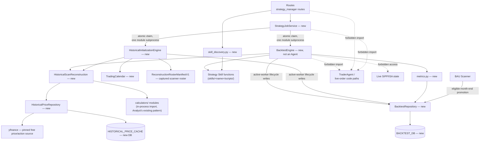
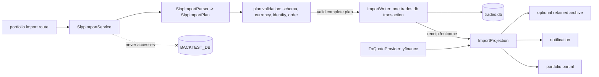

# Architecture Spine — Strategy Manager and Currency-Aware SIPP Import

## Design Paradigm

Layered architecture, ratified from the codebase and from the sibling
Realised P&L Round-Trip spine (`architecture-Agents.stocks-2026-08-08`),
not newly chosen:

**Routes** (`app/api/routes/`, FastAPI + Jinja2/htmx) → **Services**
(`app/services/`, orchestration/presentation) → **Domain Agents /
Engine** (`app/agents/` for existing agents; the Backtest Engine sits
alongside but outside the `Agent.run()` contract) → **Repositories**
(`app/repositories/`, raw `sqlite3` via `db.make_connect`/`session`).

The Backtest Engine is deliberately **not** a Domain Agent: existing
agents (`Scanner`, `Analyst`, `Alert`, `Trader`, `Extraction`) each do a
single evaluate-and-return call per pipeline tick. The Backtest Engine's
job is a stateful loop over simulated time (potentially thousands of
dates), which doesn't fit that contract — forcing it in would blur what
`Agent.run()` means for everything else.

The SIPP importer remains on the live-portfolio side of that boundary.  It is
a service-owned, two-phase operation: parse isolated upload bytes into a typed
plan, validate the complete plan, then apply it through one `trades.db`
transaction.  Archive, notification, and HTML refresh are projections after
that commit, never alternative persistence paths.





## Invariants & Rules

### AD-1 — Strategy Skill invocation is in-process, never subprocess

- **Binds:** FR-1, FR-4, FR-8
- **Prevents:** A Strategy Skill or Historical Scan Reconstruction
  shelling out per ticker/date the way `scanner_agent.py` invokes
  `screen_vcp.py` (subprocess, full-S&P500 batch, network fetch, 300s
  timeout) — infeasible across a multi-year backtest replay.
- **Rule:** Strategy logic is called in-process against the versioned host
  protocol and bounded views. Each independently releasable Skill declares a
  canonical ordered `runtime_files` allowlist and entrypoint; discovery,
  source hashing, loading, and CI use one path/import-graph validator over
  every declared executable file. Declared intra-Skill relative imports are
  allowed, but path escapes, symlinks, dynamic imports, application internals,
  repositories, agents, network/socket clients, and subprocess are rejected.
  Strategy runtime code is trusted and unsandboxed, but it owns its methodology
  and cannot acquire data outside the host boundary.

### AD-2 — Application Stage logic is shared; releasable Skills own methodology

- **Binds:** FR-1 (Weinstein-based Strategies), Glossary reuse
- **Prevents:** A Strategy Skill importing application-internal Analyst or
  `app/core` behavior, which would stop the Skill being independently
  releasable and could change its behavior without changing its source digest.
- **Rule:** Application producers share the dependency-free canonical
  classifier in `app/core/stage_classification.py`. Independently releasable
  Strategy Skills own their methodology implementation inside their hashed
  runtime and depend on application code only through the versioned
  `app.services.backtest.strategy_protocol` host API. Shared behavioral test
  vectors may detect accidental divergence without creating a runtime
  dependency. Skills never import `app/agents/` or other application internals.

### AD-3 — No-look-ahead: a runtime guard against accidental leakage, not a sandbox

- **Binds:** FR-8, FR-1, SM-3
- **Prevents:** (a) A Strategy Skill's own code accidentally reading
  Historical Price or Scan Result data dated after the simulated
  "current" date through the intended interface; (b) two independently
  authored Strategy Skills assuming incompatible shapes for the data
  they're handed.
- **Rule:** The Backtest Engine passes Strategy Skill entry/exit/
  position-sizing functions **only** a `MarketView` object, constructed
  per simulated date `D` by truncating Historical Price/Scan data to
  `<= D`. `MarketView` wraps **pandas DataFrames** (consistent with the
  existing scanner and historical-pivot code) behind
  typed accessor methods (e.g. `.price_history(security_id) -> DataFrame`,
  `.scan_result(security_id) -> HistoricalScanRecordV1 | None`) — not an ad-hoc
  list-of-dicts shape a second implementer could diverge from.
  `MarketView` **raises** if queried for a ticker/date outside its bound,
  turning an accidental look-ahead bug into a hard error at the point of
  misuse.
  The engine rejects reads outside the selected V2 universe and rejects any
  emitted `Signal.security_id` outside that universe. This remains an
  in-process trust boundary rather than an operating-system sandbox; AD-1's
  discovery/CI enforcement prevents forbidden dependency paths for trusted
  local Skills. Untrusted third-party execution and an external marketplace
  remain out of scope.

### AD-4 — Strategy job lifecycle has one ledger and race-safe writers

- **Binds:** FR-8, FR-9, FR-16–FR-20, §7.1 Sequential execution & Observability (PRD)
- **Prevents:** Bootstrap, initialization, preparation, and Backtest workers, routes, and the job
  launcher each inventing a lifecycle representation or racing to write a
  terminal status.
- **Rule:** `strategy_jobs` in `BACKTEST_DB` is the only lifecycle ledger
  for exactly `bootstrap`, `initialization`, `preparation`, and `backtest`
  jobs. Stored statuses are exactly
  `queued`, `running`, `complete`, `failed`, `cancelled`; cancellation intent
  is the separate nullable `cancel_requested_at` field. `StrategyJobService`
  writes initial `queued`, atomically claims `queued -> running`, may cancel a
  still-queued job, and may write
  fallback `failed` only when its child exits without a terminal worker
  write. A running cancel request is cooperative: the worker checks at the
  subtype's declared safe steps and writes `cancelled`; a terminal state that commits
  first wins over a late request. Commands are idempotent, each mutation
  increments `status_version`, and UI polling rejects an older version. Job
  plus exactly one matching subtype is created atomically while `deleted_at`
  is null. Integer
  `enqueue_seq` fixes FIFO order; one SQLite write transaction conditionally
  claims the smallest queued sequence and assigns a unique `claim_token`.
  `StrategyJobService` owns one persisted singleton worker lease through
  `WorkerLeasePolicyV1`. Acquire/takeover increments a generation; renew,
  claim, reconcile, dispatch, release, and every child write compare instance
  identity plus generation. Takeover atomically invalidates the prior running
  claim before further dispatch. Every worker mutation compares claim token,
  lease generation, current status, and version. On
  application startup, an unowned `running` claim becomes `failed` with code
  `worker_interrupted`; queued rows remain queued and no job auto-replays.
  After atomic claim-to-running it spawns exactly
  `python -m app.services.backtest.worker --job-id <id> --claim-token <token>
  --lease-generation <generation>`. The child validates token, generation,
  and status before every progress or terminal write;
  spawn failure or exit without a terminal write becomes fallback `failed`.
  Shutdown terminates the owned child and records `worker_interrupted`; a stale
  child from an earlier process cannot pass compare-and-swap after startup.
  Legal transitions are only `queued -> running|cancelled|failed` and
  `running -> complete|failed|cancelled`; terminal rows never transition.
  `current_month` means the month actively being processed and is set before
  its work begins. Workers check cancellation at every declared safe step and
  in the final conditional completion write, so a late cancel cannot overwrite
  `complete`. Bootstrap final activation and preparation manifest-seal plus
  initial-Backtest creation are non-cancellable transactions: acknowledged
  cancellation guarantees no activation/no Backtest, while a transaction that
  commits first wins and completes.
  Routes/UI read lifecycle through `BacktestRepository`; no status sidecar
  is authoritative.

### AD-5 — Reconstruction cache is keyed to survive detector changes

- **Binds:** FR-7, §7.1 Reproducibility (PRD)
- **Prevents:** A Backtest Run silently reusing a Historical Scan
  Reconstruction computed under an old, since-changed detector
  implementation.
- **Rule:** `scan_reconstruction_cache`'s composite primary key —
  `(security_id, date, detector, detector_version, input_revision)` — is an enforced SQL
  constraint (the upsert target), not just a logical convention.
  `detector_version` and Strategy Skill version (FR-10 reproducibility)
  are SHA-256 hashes of one canonical UTF-8 JSON source manifest: sorted keys
  and POSIX relative paths, normalized newlines, and an explicit runtime
  source/config allowlist; caches, bytecode, logs, generated outputs, and tests
  are excluded. Both producers call the same canonicalizer. Full monthly
  scanner output is stored under
  `(profile_hash, snapshot_month, security_id)`; `profile_hash` includes the
  detector hashes, so a detector change can never make an old monthly
  snapshot appear current.

### AD-6 — Historical Price Data is immutable, content-revisioned evidence

- **Binds:** FR-4, FR-5, FR-6, OQ-1 (PRD)
- **Prevents:** Reusing `price_cache_repo.py` for historical OHLCV — it
  stores exactly one current snapshot per ticker (`UPSERT ON
  CONFLICT(ticker)`, overwrites), structurally incapable of holding a
  time series.
- **Rule:** A new `HistoricalPriceRepository`, backed by
  `HISTORICAL_PRICE_CACHE`, stores immutable normalized yfinance daily
  OHLCV observations and effective-dated split/dividend events by local
  `security_id`, observed symbol, session date, and content-derived
  `data_revision`. “Raw” here means `provider_native`, not exchange-tape raw.
  The complete request contract is `interval="1d"`, explicit inclusive start
  and exclusive end (including the versioned warm-up/action buffer),
  `prepost=False`, `auto_adjust=False`, `back_adjust=False`, `actions=True`,
  `repair=False`, `keepna=True`, `rounding=False`, and the AD-21 timeout/error
  policy. Evidence retains provider-native OHLCV, `Adj Close`, splits,
  dividends, observed symbol, currency, provider exchange timezone, request
  bounds, response-metadata digest, fetch time, yfinance version, and normalized
  content digest; heuristic repair is forbidden.

  Three non-interchangeable price planes are canonical. `provider_native` is
  evidence only. `as_traded` reverses every provider-applied retroactive split
  factor after each row through the evidence cutoff; fills and valuation use
  it, while AD-20 applies each split once on its effective session.
  `split_continuous_as_of_D` derives from `as_traded` using only split events
  effective by `D`; indicators use this plane and never dividend-adjusted
  prices. No future action is exposed to a Strategy. Ordinary split,
  reverse-split, and dividend qualification fixtures prove value continuity,
  correct shares, and exactly one economic dividend benefit.
  Volume has matching versioned planes. `provider_native_volume` is retained
  unchanged. Qualification must establish that it represents session share
  count; otherwise initialization stays disabled. `as_traded_volume` is that
  same count. `split_continuous_as_of_D_volume` multiplies each earlier session
  by the product of split ratios effective in `(session, D]` (so a 4:1 split
  multiplies prior volume by 4 and a 1:10 reverse split by 0.1). It uses Decimal
  arithmetic quantized to 8 decimal places with `ROUND_HALF_EVEN`; zero stays
  zero and missing stays null. Every volume-sensitive detector uses only this
  accessor. Ordinary and reverse-split fixtures cover both price and volume.

  Canonical content identity excludes acquisition time but includes request
  contract/version, observed symbol, currency/timezone, canonical columns,
  sorted exchange-local sessions, IEEE-754 finite-number encoding, JSON `null`
  for missing values, and normalized action rows. Acquisition metadata is
  retained beside it. Revision granularity is one security and one canonical
  request interval; overlapping content is never merged implicitly. Changed
  evidence creates a new revision and never overwrites referenced evidence.
  Identity resolution uses AD-14's immutable effective-dated alias manifest;
  unknown/colliding aliases fail rather than being inferred from symbol text.

### AD-7 — Strategy Parameters: declared once, validated once

- **Binds:** FR-2, FR-3, FR-8, FR-13
- **Prevents:** (a) A second metadata file (`params.yaml`) drifting out
  of sync with `SKILL.md`'s existing `name`/`description` frontmatter;
  (b) the UI (FR-13) and the engine (FR-8) each implementing their own,
  potentially-divergent parameter validation.
- **Rule:** Each Strategy Skill's `SKILL.md` YAML frontmatter gains
  `kind: backtest-strategy`, integer `api_version`, and a `parameters:` array
  (`name`, `type`, `default`, `description`,
  `required`, constraints such as `min`/`max`/`enum`). Discovery (FR-3)
  lists only supported kinds/API versions. V1 types are `integer`, `number`,
  `boolean`, `string`, and homogeneous `enum`; canonical JSON retains declared
  names and JSON scalar types. Constraint validation (required/type/min/max/
  enum) happens in exactly **one** place: a protocol-level function in
  `strategy_protocol.py`, delivered with Strategy discovery. It returns
  normalized typed parameters or structured field errors. Discovery uses it
  to validate defaults; the Backtest launch path (FR-8) and UI (FR-13) consume
  that same function rather than re-implementing its rules.

### AD-8 — Run-instance JSON blobs have a fixed shape, not opaque strings

- **Binds:** FR-8, FR-10, FR-11, FR-12, FR-14
- **Prevents:** The run-launcher and the FR-11 comparison view each
  picking a different, incompatible shape for a Backtest Run's stored
  parameters or metrics.
- **Rule:** `strategy_runs.parameters_json` keys match the Strategy
  Skill's declared parameter names verbatim (AD-7). `backtest_results.
  metrics_json` has exactly four keys — `total_return`, `sharpe_ratio`,
  `win_rate`, `max_drawdown`; `total_return` is
  `(ending_equity - starting_equity) / starting_equity`, with launch
  validation requiring positive starting equity. The ratio is stored as a
  float; percentage formatting/rounding is presentation-only.
  `sharpe_ratio`/`win_rate` are `null` for a zero-closed-trade run (never
  a divide-by-zero or a bare `0`).
  Sharpe is annualized from daily equity returns at a 0% risk-free rate using
  `sqrt(252)`; fewer than two returns or zero variance yields `null`. Win Rate
  is profitable closed trades divided by all closed trades. Max Drawdown is
  the minimum peak-to-trough percentage of the daily Equity Curve. Positions
  valued at the final close affect Total Return/Drawdown but are not closed
  trades unless the Strategy emitted an exit.

### AD-9 — `BACKTEST_DB` tables have explicit keys

- **Binds:** FR-8, FR-9, FR-10, FR-11, §7.1 Reproducibility (PRD)
- **Prevents:** A schema-owner story and a writer story assuming
  incompatible uniqueness/idempotency semantics because no PK/FK was
  fixed at this altitude.
- **Rule:** `strategy_jobs.id` — PK, generated; `parent_job_id` is a nullable
  self-FK to a retained tombstone. `initialization_runs.job_id` and
  `strategy_runs.id` are each
  PK+FK to `strategy_jobs.id`. `backtest_results.run_id`
  — PK **and** FK to `strategy_runs.id` (enforces the 1:0..1
  cardinality a Backtest Run has at most one Result). `trade_log.id` — PK,
  generated; `trade_log.run_id` — FK. `equity_curve` — composite PK
  `(run_id, date)`. `snapshot_profiles.profile_hash` — PK;
  `snapshot_months` — composite PK `(profile_hash, snapshot_month)`;
  `snapshot_members` — composite PK
  `(profile_hash, snapshot_month, security_id)`;
  `monthly_scan_results` — composite PK
  `(profile_hash, snapshot_month, security_id)`; `scan_reconstruction_cache` —
  composite PK per AD-5. CHECK constraints close job type/status/source/member
  vocabularies. Repository creation transaction enforces exactly one subtype
  matching `job_type` only while `deleted_at IS NULL`; transition
  compare-and-swap enforces AD-4. Backtest
  work-in-progress lives only in attempt-owned `backtest_staging` keyed by
  `run_id`; completion promotes Result, Trade Log, and Equity Curve in one
  transaction, while tombstone Delete cascades only staging/config rows.

### AD-10 — No live-account code path is reachable from this feature

- **Binds:** §5 Non-Goals, §7.2 Safety (PRD)
- **Prevents:** The PRD's Safety guardrail ("no code path that submits
  live orders or touches the live SIPP/ISA portfolio") degrading into a
  UI-only omission that a future refactor could accidentally cross.
- **Rule:** None of `BacktestEngine`, `HistoricalInitializationEngine`,
  `StrategyJobService`, Strategy Skill runtime modules, or
  `app/api/routes/strategy_manager.py` may import or access `TraderAgent`,
  live SIPP/ISA portfolio, trades, cash, or position repositories, or any
  live-order-submission path. This is an import-graph boundary, checkable
  mechanically (e.g. a lint rule or import-graph test), not just a
  documented intent.

### AD-11 — Skill discovery fails soft, per-skill

- **Binds:** FR-3
- **Prevents:** One malformed `skills/` folder taking down discovery for
  every other, valid Strategy Skill; two skills silently colliding on the
  same declared name.
- **Rule:** A new `skill_discovery.py` module skips a malformed/incomplete
  Strategy Skill with a visible warning (never fails discovery wholesale),
  and flags — rather than silently resolving — two skills that declare
  the same Strategy name/id.

### AD-12 — Trade fill reference price is fixed, not assumed per-implementation

- **Binds:** FR-8
- **Prevents:** The engine's fill logic and any test/expectation authored
  elsewhere disagreeing on same-bar-close vs. next-day-open, silently
  producing different Trade Log values for the same Strategy.
- **Rule:** Trade fills use the next trading day's open, following the
  signal date. Edyau explicitly confirmed this binding v1 convention on
  2026-08-10; it prevents filling at the same-bar close used to detect
  the signal.

### AD-13 — Monthly scanner snapshots have one versioned identity

- **Binds:** FR-4, FR-5, FR-7, FR-8; UX Historical Coverage Rules
- **Prevents:** Initialization, BAU promotion, and Backtest launch each
  defining “the May snapshot” or “Ready” differently.
- **Rule:** Snapshot identity is canonical `YYYY-MM`. For every expected
  security, the as-of date is the **last completed trading session of that
  calendar month on the calendar selected by its MIC**, using that exchange's
  IANA timezone; early-close sessions count. V1's closed mapping is
  `XNAS -> XNYS`, `XNYS -> XNYS`, and `XLON -> XLON`; any other MIC fails
  roster qualification rather than guessing. One shared `TradingCalendar`
  service and versioned calendar dataset enumerate these sessions for
  initialization, validation, BAU promotion, and comparison. Calendar dataset
  identity is the SHA-256 of the canonical XNYS/XLON session table from
  1970-01-01 through 2100-12-31, including opens, closes, and session labels;
  package version alone is not the identity. A profile hash
  binds the canonical `HistoricalScanRecord` schema, detector manifests,
  reconstruction-roster/source policy versions, calendar policy/data version,
  yfinance ingestion contract/version, and the provenance quality vocabulary
  in AD-18. Exact roster, price/action revisions, and content digests are bound
  per month by AD-14, not globally. A single policy profile may contain both
  reconstructed and BAU-observed months, so later BAU months can extend the
  same policy profile without pretending to share an old reconstructed roster.
  Current-incomplete
  or future months are rejected server-side; only a fully closed historical
  month may be reconstructed. Runs normalize start/end to calendar months,
  pin one profile, and consume only its committed records. A member enters the
  candidate set only at its recorded month-end session and remains eligible
  until superseded by its next committed monthly scan; it is never backdated.
  Strategies may evaluate on intervening sessions. A next-open fill outside
  the normalized run end is recorded as skipped, not executed.

### AD-14 — Coverage readiness is manifest-backed and transactional per month

- **Binds:** FR-4, FR-5, FR-7; UX Initialize/Ready/failure states
- **Prevents:** Earliest/latest/count implying a continuous usable range
  across a failed month, or one missing ticker/source being treated
  differently by independent implementations.
- **Rule:** `snapshot_months` is the coverage manifest and
  `snapshot_members` is its immutable proof. For a reconstructed profile, the
  expected set is an addressable immutable `ReconstructionRosterManifestV1`
  captured once when that profile lineage is created under
  `ReconstructionRosterPolicyV1`. Restarts and contiguous extensions reuse it;
  only an explicit policy/profile refresh captures a new roster. The policy
  takes the normalized union, in fixed source order, of the full current
  DataHub S&P 500 roster plus current TradingView US and UK screen outputs.
  All three sources are required; capture fails before month processing if any
  source cannot be retrieved and validated. Institutional/email-derived and
  portfolio-only tickers are excluded by policy. Symbols are Unicode-normalized,
  trimmed, and uppercased while exchange suffixes are preserved; canonical key
  is `(MIC, normalized_provider_symbol)`. Exact duplicates union source
  memberships; conflicting MIC/currency identity fails capture. A first-seen
  `security_id` is an opaque generated id allocated once in an immutable
  `SecurityIdentityRegistryV1`; it is never derived from a symbol. Renames
  require an immutable `SecurityAliasManifestV1` row with security id,
  provider, observed symbol, MIC, non-overlapping effective dates, evidence
  source/digest, alias revision, and manual-override provenance; symbol text
  alone never joins identities. The roster manifest records normalized members,
  identity-registry and alias revisions, source payloads, retrieval times,
  source/package/config versions, expected count, and SHA-256 digest. This
  proves which roster was processed; it does **not** prove historical market
  completeness or remove survivorship bias. V1's closed legitimate-exclusion
  registry has one code: `before_first_provider_observation`. It is legal only
  after a successful canonical full-history request produced at least one valid
  later observation for the same resolved security and exact evidence revision;
  the requested canonical session must precede that first observation. The
  persisted proof includes alias result/revision, request/revision digest,
  first observed session, requested session, MIC/calendar digest, currency, and
  acquisition timestamp. The code describes provider-observed lifetime only
  and never claims a verified IPO/listing date. Absence after the first observed
  session, `not_tradeable`, ambiguous identity, partial/provider/system errors,
  and unknown states remain `unresolved` and fail the month. Internally, Ready
  means `processing_complete=true` and `market_complete=unknown`.
  Intentionally unavailable historical fields are null only where the
  versioned reconstructability policy permits. Expected/resolved/valid/excluded
  counts and member/result digests must balance; member rows, scan rows, and the
  manifest commit in one `BACKTEST_DB` transaction after immutable input
  revisions are verified. Staging rows are invisible. Initialization is
  complete only when every requested month is committed for one profile; one
  shared coverage function validates the full ordered sequence.

### AD-15 — Recovery is a new attempt; Delete never reaches shared evidence

- **Binds:** FR-9, FR-10; UX Cancel/Restart/Delete
- **Prevents:** A fake “resume” that cannot reproduce simulation state, retry
  mutation erasing audit history, or deletion breaking overlapping ranges and
  completed results.
- **Rule:** There is no simulation checkpoint and no month-level resume.
  `failed`/`cancelled` attempts are immutable; Restart creates a new queued
  job with `parent_job_id` and replays from its beginning while reusing
  committed Historical Price and monthly scan caches. Delete is legal only
  for `failed`/`cancelled` attempts after cancellation is acknowledged and is
  implemented as a tombstone: retain id, parent/child lineage, type, terminal
  status, timestamps, copied display label/range/summary, and audit text;
  atomically set `deleted_at` and erase type-specific configuration plus
  attempt-owned partial outputs. It never cascades to descendants, committed
  shared evidence, or a complete Backtest Result.

### AD-16 — Strategy Manager work is sequential; BAU remains independent

- **Binds:** FR-9, §7.1 Sequential execution; UX background activity
- **Prevents:** Initialization and Backtests bypassing each other's queue,
  while Strategy Manager work accidentally blocks market-hours BAU scanning.
- **Rule:** `StrategyJobService` owns one FIFO queue/lock shared by
  initialization, Backtest, and restarted attempts. The live BAU pipeline
  retains its existing independent lock and may run concurrently. V1 runs as
  one local Uvicorn process with persistent local SQLite; multi-process/remote
  workers require a new distributed claim design. A repository-owned
  `is_promotable_bau(profile, run)` is the sole eligibility predicate. For every
  expected member, the source run must complete after that MIC session closes;
  `as_of_session_date` must equal AD-13's canonical session; every source cutoff
  must be no later than that session; and canonical record-schema, detector,
  roster, alias, calendar, source-input, reconstructability-policy,
  provenance-vocabulary, and payload digests must be present. No reconstructed
  member may be mixed into an `observed_bau` month. Promotion stores
  `observed_at`, source run id, and per-member cutoff/payload digests and rejects
  any mismatch.
  Promotion is immutable compare-and-insert: identical content is a no-op;
  different content under the same month/profile is an integrity failure,
  never an overwrite. Reconstruction and BAU race through the same commit
  predicate. A missed/ineligible past month remains reconstructable later.
  Only a fully closed month-end BAU run may perform the additional evidence
  capture work; ordinary daily scans retain their existing presentation-only
  `StockRecord` output. The authoritative scanner completion path first atomically publishes a
  versioned `BauSnapshotCaptureV1` alongside its run-owned analysis artifact;
  it contains the complete roster-bound member/session/cutoff/record evidence
  required by this predicate. Dashboard `StockRecord` output, scan history,
  and a current live scan are presentation artifacts and are never promotion
  input. Promotion consumes only that durable capture after successful artifact
  publication; a missing/invalid capture makes the BAU month ineligible.
  The scanner must therefore retain a dedicated identity-bound raw-evidence
  capture for an eligible run (provider bars/actions, acquisition instant,
  alias/MIC/session/cutoff and detector inputs) before presentation conversion.
  `HistoricalScanReconstructor` is reconstruction-only and cannot emit
  `observed_bau`; a separate observed-BAU builder consumes that run-owned raw
  capture. The durable capture envelope is the only promotion input: promotion
  reloads it after publication and verifies completed run ownership. Capture
  persistence/promotion failures are visible warnings and never reverse an
  otherwise successful scanner artifact. Evidence-retention references are
  committed with, or reconciled from, the immutable snapshot winner.

### AD-17 — Notifications are job-linked views of live legality

- **Binds:** FR-9, FR-12–FR-15; UX Notification activity
- **Prevents:** Per-month notification floods, stale actions mutating terminal
  jobs, or deleted activity links silently failing.
- **Rule:** Add `strategy_initialization` and `backtest` categories plus a
  unique nullable `job_id`. Each authoritative job mutation writes/upserts one
  `BACKTEST_DB` notification-outbox row in the same transaction. An idempotent
  projector updates one notification per job in `notifications.db`; pending
  outbox rows repair cross-database failure on startup/poll. Notification loss
  never changes job state. Actions are derived at request time from the live
  job, and stale/illegal commands are rejected idempotently. Tombstoning an
  attempt preserves notification text but clears target/actions. Projection
  acknowledgement compares both `job_id` and `job_status_version`; a concurrent
  newer row remains pending, and `notifications.db` rejects a lower version
  than already projected.

### AD-18 — Historical records and source provenance are canonical

- **Binds:** FR-4, FR-5, FR-7, FR-8
- **Prevents:** Historical Reconstruction copying present-day enrichment into
  the past or BAU/reconstruction serializing incompatible scanner payloads.
- **Rule:** `HistoricalScanRecordV1` is the sole payload returned by
  `MarketView.scan_result`: stable local `security_id`, observed symbol/MIC,
  snapshot month and exchange session, reconstructable technical fields,
  detector outputs, nullable policy-approved enrichment, and provenance
  digests. Every snapshot month stores `provenance_quality` as exactly
  `best_effort_reconstructed` or `observed_bau`. Reconstructed records cite the
  AD-14 captured roster and yfinance evidence revisions and explicitly carry
  the known limitation that yfinance has no point-in-time universe or
  historical TradingView screen. BAU records preserve the scanner output
  actually observed at that month-end. A field-by-field
  `ReconstructabilityPolicyV1` says historical, nullable, or fatal; current-only
  enrichment is never copied backward. Missing qualifying evidence fails that
  month without fabricating a source-gap inventory. The typed
  `historical_scan_record.py` model closes exact field names, types,
  units, nullability, enum values, and canonical UTF-8 JSON serialization; every
  producer and digest calls that one model, and its schema version is profile-
  bound. UI projections label
  reconstructed coverage/results “Best-effort yfinance” and keep observed BAU
  provenance distinguishable. Durable fields include
  `universe_basis=captured_configured_roster`, `roster_captured_at`,
  `point_in_time_universe=false`, and `survivorship_bias=known`. Fixed result and
  coverage copy states: **“Survivorship-biased reconstruction; not a
  point-in-time market universe.”** It also states that prices/actions come from
  yfinance, the universe is a captured current scanner roster, and renamed or
  delisted securities may be absent. Mixed ranges show month counts/ranges for
  each provenance quality rather than one blended label.

### AD-19 — Coverage, results, and comparison have one repository predicate

- **Binds:** FR-8, FR-11, FR-12–FR-15
- **Prevents:** UI selectors implying continuity from min/max/count, mixing
  profile versions, or accepting a stale/ineligible comparison.
- **Rule:** `active_snapshot_profile` is an explicit repository pointer with a
  monotonically increasing activation sequence. Only AD-28 Bootstrap creates
  or activates a profile. Initialization requires and pins a compatible active
  profile; Restart and extension keep their pinned profile. A Bootstrap
  policy/version change creates and atomically activates a new profile;
  in-flight jobs remain pinned to the old
  one. Old profiles remain immutable and never merge into the active Ready
  range. Coverage discovery returns maximal contiguous committed month
  intervals plus earliest/latest/count. Queue acceptance stores profile hash,
  normalized range, and an ordered-month digest over every month's roster,
  input-revision, provenance-quality, and content digests; worker start
  revalidates them.
  `is_comparable(left,right)` dispatches by manifest version. V1 requires distinct,
  non-tombstoned, `complete` Backtest Results with exact range, profile hash,
  ordered-month digest, base currency, and execution-contract digest. Strategy
  source, parameters, and starting capital may deliberately differ. AD-31
  supplies the complete V2 predicate; cross-version comparison is rejected. It is
  used both for candidates and submit-time validation. The results
  projection contains only backtests, ordered by `enqueue_seq DESC`, with
  metrics absent until complete.

### AD-20 — Strategy and simulation contracts are versioned and deterministic

- **Binds:** FR-1, FR-2, FR-8, FR-10, FR-14
- **Prevents:** Independently authored Skills, engine, and metric tests choosing
  incompatible signatures, warm-up, capital, or trade-accounting semantics.
- **Rule:** `StrategyProtocolV1` exposes
  `entry_signals(view, parameters) -> list[Signal]`,
  `exit_signals(view, portfolio, parameters) -> list[Signal]`, and
  `position_size(signal, view, portfolio, parameters) -> int`; both
  `MarketView` and read-only `PortfolioView` are bounded to the simulated
  session. `Signal` carries
  `security_id`, side, signal session, rule id, and deterministic sort key.
  Calls return typed values or stable error codes, never persistence objects.
  Each detector declares required
  lookback; the engine fetches the maximum warm-up before the first requested
  month but never exposes warm-up as an eligible simulation period. Starting
  capital is a positive persisted run input. Each run persists a user-selected
  base currency (`GBP` default or `USD`), and quote currency plus unit/scale are
  mandatory evidence. Closed quote units are USD (`scale=1`), GBP (`scale=1`),
  and GBp (`scale=0.01 GBP`). Mixed US/UK holdings use only immutable yfinance
  `GBPUSD=X` daily evidence, interpreted as USD per GBP: GBP-to-USD multiplies by
  the rate and USD-to-GBP divides by it after applying quote-unit scale.
  Conversion uses the most recent FX close whose UTC-normalized session is
  complete by the fill/valuation instant, with no carry across more than five
  calendar days. Provider numbers enter as `Decimal(str(value))`; each ledger
  conversion and daily valuation is quantized to 8 base-currency decimal places
  with `ROUND_HALF_EVEN`, and metrics consume those values. Missing or ambiguous
  currency/unit/FX fails the run. Dividends convert on their credit session.

  A canonical cache-only `RunInputManifestV1` is the replay authority. Its hash
  includes Strategy, detector, Backtest Engine, `MarketView`, ledger/action
  policy, and `metrics.py` source manifests; protocol/schema/serializer versions;
  Python version, runtime-lock digest, calendar-session-table digest, timezone
  data, numeric/rounding policy; alias revision; sorted exact per-security
  price/action/FX request and revision digests; snapshot profile/month/content
  and ordered-month digests; parameters, base currency, and starting capital.
  Canonical ordering, UTC/session normalization, JSON-null/finite-float encoding,
  and UTF-8 bytes follow AD-5/AD-6. Replay never refetches or selects a newer
  revision and fails `evidence_missing` when any pinned evidence is absent. The
  The full hash is `run_input_manifest_digest` and includes Strategy,
  parameters, capital, and exact replay evidence. A separately persisted
  `execution_contract_digest` hashes only engine, protocol, `MarketView`,
  fill/ledger/action/metrics/numeric/rounding/runtime semantics; AD-19 requires
  this equality while deliberately allowing Strategy and parameter differences.

  For equal-session signals, sort by
  session then stable `security_id`; execute SELL before BUY, enforce available
  cash, use integer shares rounded down, zero commission/slippage, and AD-12
  fills. Record skipped signals with codes. Open positions are valued at final
  session close but not fabricated into closed trades. `metrics.py` is the only
  calculation owner for AD-8. V1 corporate actions are closed to stock splits
  and cash dividends. A split effective on session D is applied before D's
  signals, multiplies shares, and inversely adjusts per-share basis without
  changing position value. A dividend event dated D is an explicit v1
  approximation: shares held at D's open (carried from the prior close) receive
  cash before D's signals, treating the yfinance event date as both entitlement
  and payment date. Result provenance records `DividendCashPolicyV1`; no
  indicator uses a dividend-adjusted series, so the benefit occurs exactly once.
  Both actions create ledger/Trade Log events with provider date, normalized
  exchange session, amount/ratio, currency, evidence digest, and policy version.
  Any other
  action on an open position fails the run with `unsupported_corporate_action`.

### AD-21 — V1 operations fail visibly and remain local

- **Binds:** FR-4, FR-9, FR-12–FR-15
- **Prevents:** Runtime topology, retries, duplicate suppression, or route
  exposure changing job semantics between stories.
- **Rule:** All Strategy Manager mutations use the existing
  `require_local_or_token` guard. Equivalent submissions are allowed as
  distinct immutable attempts; client retries may reuse an explicit
  idempotency key. There is no hard whole-job timeout in v1. The adapter owns a
  closed provider outcome taxonomy and fetches per security/request. Transport
  errors, HTTP 408/429/5xx, and explicit throttling retry up to three total
  attempts with a 15-second attempt timeout, delays of 1s then 2s plus
  deterministic job/request-key jitter in `[0,250]ms`, capped at 2.25s.
  Authentication/contract errors, malformed payloads, empty required intervals,
  partial data, currency/timezone mismatch, and alias ambiguity do not retry.
  Stable codes are `provider_unavailable`, `provider_throttled`,
  `provider_contract_error`, `required_data_missing`, `identity_ambiguous`,
  `calendar_error`, and `integrity_error`; only the adapter translates provider
  outcomes. Initialization processes months ascending and members by stable
  `security_id`, fails fast on the first unresolved member, retains earlier
  committed months, and processes no later month in that attempt. Thus
  `failed_month` is deterministic. Timestamps are UTC instants; exchange
  session dates remain local dates. Schema creation/migrations are owned by the
  two new repositories at application startup, matching the brownfield
  one-database-per-concern pattern.

### AD-22 — Free-source qualification is explicit and bounded

- **Binds:** FR-4, FR-5, FR-6, FR-8
- **Prevents:** Free data being presented as exact point-in-time evidence,
  heuristic price repair changing results, or a paid/alternate source silently
  changing one run's inputs.
- **Rule:** V1 deliberately uses only free sources: pinned yfinance for daily
  prices/splits/dividends/FX and selected `exchange_calendars==4.13.2` as the
  versioned internal XNYS/XLON session authority (to be locked by the
  qualification story). No paid provider, Stooq fallback, or MCP-mediated runtime path
  is permitted. A first implementation qualification suite must pass calendar
  fixtures for ordinary/holiday month-end, early and unscheduled closure, and
  DST, plus representative active/renamed US and LSE price, split, dividend,
  GBP/USD FX, stale-FX, repeat-fetch, digest, and AD-14 exclusion-boundary
  fixtures (before first provider observation excludes; absence on/after first
  observation fails). Passing qualifies the
  mechanics—not historical-universe completeness. V1 does not rely on yfinance
  for complete point-in-time membership, delisted/symbol-history coverage, or
  historical TradingView screens; those properties are not guaranteed, and
  AD-14 and AD-18 make the accepted limitation visible.
  Baseline qualification failure leaves initialization unavailable. After it
  passes, AD-21 is the sole retry table: transport/throttle/server outcomes may
  consume bounded retries. A successful response before the first provider
  observation follows AD-14's sole evidence-backed exclusion; every other
  empty, partial, missing, or ambiguous observation fails the affected month
  immediately, with a concise reason and no gap inventory.

### AD-23 — SIPP import is an isolated plan with one authoritative commit

- **Binds:** GitHub issue #210 items 1, 7–12, 29–30.
- **Prevents:** concurrent uploads sharing `merged.csv`, a parser writing
  while it discovers errors, and trades/cash/snapshots committing different
  portions of one upload.
- **Rule:** `SippImportService` accepts request-owned bytes and decodes them
  once into a streaming CSV reader. `SippImportParser` creates a typed
  `SippImportPlan` before any write; a plan has source digest, profile version,
  ordered typed rows, validation issues, and its selected closing-balance
  candidate. `SIPP_IMPORT_DIR/merged.csv` is retired. Only a valid complete
  plan reaches `ImportWriter`, which owns one `trades.db` SQLite transaction
  containing the import receipt, row outcomes, trades, cash movements,
  per-currency balance state, and its portfolio snapshot. Any error rolls all
  of those writes back. Routes/services/repositories must accept the caller's
  connection for this unit of work and must not open a second committed session
  inside it.

### AD-24 — Source money and reporting valuation are distinct, typed facts

- **Binds:** GitHub issue #210 items 3–5, 24–28, 31–35.
- **Prevents:** stripping EUR/USD/HKD markers and labelling their raw number
  GBP, one currency's Running Balance overwriting another, or a missing FX
  quote becoming an invented conversion.
- **Rule:** Each accepted monetary field is `Decimal(amount)` plus uppercase
  ISO 4217 `currency`; source amount/currency are immutable. The selected SIPP
  import profile supplies the source currency only when the CSV has no
  conflicting marker or currency column. Otherwise ambiguous, unsupported,
  malformed-locale, or contradictory monetary evidence is a validation error.
  `cash_balances` is keyed by `(portfolio_id, currency)` and stores a dated
  statement balance; zero and negative values are valid. The existing
  Portfolio reporting currency is GBP, but GBP numbers are valuation
  projections, not ledger replacements. A projection records a dated,
  immutable yfinance FX quote (pair, provider, as-of, rate, digest); missing,
  stale, or ambiguous FX is `valuation_unavailable`, retaining source money
  without guessing. Decimal scale/rounding is centralised in `Money`, never
  delegated to `float` or a template.

### AD-25 — Import receipts own idempotency and externally visible outcome

- **Binds:** GitHub issue #210 items 2, 6–7, 23, 33.
- **Prevents:** broker `Reference` or a nullable reference silently deciding
  whether unrelated rows are duplicates, HTTP/UI success counts claiming
  inserts that SQLite ignored, and a file-position-based key missing the
  overlapping-file duplicate scenario (the same trade re-appearing at a
  different row/file offset across two exports).
- **Rule:** `sipp_import_receipts` and `sipp_import_rows` own import lineage.
  A row's deterministic Idempotency Key is `(portfolio, MD5(Date + Symbol +
  Sedol + Quantity + Description))` — derived from what the trade *is*, not
  from which file or row position it came from, and never from broker
  `Reference` alone. *(Amended — supersedes the original source-content-digest
  + physical-row-number + normalised-payload + profile-version key, which the
  #210 reviewer gate found does not catch the overlapping-file duplicate
  scenario it was meant to; see `prd-Agents.stocks-2026-08-10` FR-11/OQ-5.)*
  Two genuinely distinct trades sharing Date, Symbol, Sedol, Quantity, and
  Description collide on this key and the second is treated as `duplicate` —
  an accepted trade-off, chosen deliberately over the more granular key that
  failed the more common and more damaging overlapping-file case. Broker
  reference remains provenance only and plays no part in the key; blank and
  any-cased `n/a` normalise to null. Every row has exactly one persisted
  outcome: `inserted`, `duplicate`, `skipped`, or `failed`, with stable reason
  code. Repository insert methods return their actual outcome. The response
  and notification report those four counts separately. A rejected or failed
  plan returns a non-2xx response and is never included in a client queue's
  imported total.

### AD-26 — Portfolio events have durable identity, ordering, and match trace

- **Binds:** GitHub issue #210 items 13–23.
- **Prevents:** raw ticker text being the lot identity, import order deciding
  FIFO, float residues changing a match, or an unmatched sell being
  impossible to investigate.
- **Rule:** Imported trade rows reference a portfolio security identity, not
  only `ticker`. `PortfolioSecurityIdentity` has opaque ID plus effective-dated
  broker-symbol/market aliases; alias ambiguity fails validation. A trade
  stores source currency, Decimal price/quantity, broker execution timestamp
  and statement sequence when available, immutable import-row lineage, and a
  deterministic fallback order. Realised P&L consumes one ordered event stream
  `(execution timestamp, statement sequence, import-row key)` and writes a
  replay trace with candidate lots, consumed amounts, identity/ordering
  decisions, skipped source rows, and unresolved quantity. Opening lots and
  corporate actions are explicit evidence-backed event types. Unsupported
  actions, absent cost basis, oversells, and corrections remain visible
  unresolved states; FIFO never fabricates a BUY/SELL match or silently drops
  an invalid date. One `Decimal` precision and rounding policy serves holdings
  replay and realised P&L.

### AD-27 — Import projections are post-commit, scoped, and recoverable

- **Binds:** GitHub issue #210 items 8–12, 27–30.
- **Prevents:** an archival/notification failure changing financial data,
  stale balances entering a snapshot/partial, permanent unbounded sensitive
  uploads, or a queued response repainting a different selected portfolio.
- **Rule:** `ImportProjection` derives the authoritative post-commit
  portfolio state from the committed receipt and balance ledger; it never uses
  a discarded plan candidate. Archive is an optional immutable post-commit
  copy, constrained by configured maximum size and retention policy; archive
  errors only produce observability events. Notifications are projections of
  receipt outcome, not proof of persistence. The multi-file UI locks its
  captured portfolio ID while queued and discards a response whose portfolio
  ID no longer matches the active view. The portfolio template renders a
  present zero/negative balance and source currency; GBP reporting values only
  render when AD-24 valuation is available.

### AD-28 — Bootstrap is explicit, idempotent orchestration

- **Binds:** FR-16, FR-20, CAP-2, CAP-7
- **Prevents:** CLI, UI, tests, and recovery paths sequencing qualification,
  roster capture, profile construction, and activation differently or exposing
  partial foundations as usable.
- **Rule:** `StrategyBootstrapService` enqueues a `bootstrap` job under
  `BootstrapContractV1`, which pins qualification, runtime, roster, source
  bundle, and profile-policy identities. The worker advances through the
  closed stages `qualification`, `roster_identity_capture`,
  `profile_validation`, and `final_activation`. It retains immutable audit
  evidence when a prior stage fails, but only one final repository transaction
  may verify the claimed job/evidence, insert or reuse the profile,
  compare-and-swap the active profile, mark the job complete, and write its
  notification outbox. Repository-owned compatibility compares the contract
  and active-profile identities; a compatible repeat is a persisted verified
  no-op without live roster recapture. Fixture and Production use one
  `StrategyProviderBundleV1` composition boundary; fixture identity is pinned,
  isolated to temporary Strategy stores, and rejected outside the explicit
  test environment.

### AD-29 — Readiness is one typed read-only projection

- **Binds:** FR-17, FR-21, CAP-6, CAP-7
- **Prevents:** Routes, diagnostics, onboarding, and tests inventing different
  prerequisite, worker, failure, or recovery meanings; readiness GETs repairing
  state as a side effect.
- **Rule:** `StrategyReadinessService` composes qualification, roster, active
  profile and activation sequence, contiguous coverage, the AD-4 persisted
  worker lease, queue/busy state, Strategy discovery warnings, and a bounded
  allowlisted `RecentJobFailureV1` into `StrategyReadinessV1`. Prerequisites use
  only `missing`, `running`, `ready`, `stale_incompatible`, `failed`, and
  `integrity_error`; `WorkerReadinessV1` uses only `disabled`,
  `unavailable_interrupted`, `busy`, and `ready`. Each non-ready item carries a
  stable reason and recovery action from one versioned vocabulary. Page loads,
  diagnostics, and readiness never mutate the lease, jobs, or evidence.
  Run-specific evidence readiness is absent until Strategy, universe, period,
  capital, and base currency are complete. Diagnostics expose only allowlisted
  identities, bounded type/stage/code/time/recovery fields, and fixture/live
  distinction—never secrets, paths, payloads, raw `failure_detail`, or database
  mutation advice.

### AD-30 — Declared Run universe is Strategy metadata, not a parameter convention

- **Binds:** FR-18, FR-20, CAP-1, CAP-3
- **Prevents:** The host inferring universe semantics from a parameter named
  `security_id`, accepting stale/free-text identities, or allowing an unrelated
  security into a V2 view or signal.
- **Rule:** SKILL frontmatter declares `universe` with
  `schema_version: strategy_universe.v1`, `mode: single-security`, and
  `parameter_name` mapped to one declared string parameter. Discovery validates
  the declaration and mapping. A roster-backed selector reads immutable active-
  profile identities in deterministic symbol/MIC order and emits
  `RunUniverseSelectionV1` containing profile hash, activation sequence, and
  exactly one immutable security ID. Launch revalidates all fields and injects
  the host-bound parameter server-side; it is never a generic editable/default
  field. `run_universe_digest` hashes universe schema, mode, mapping, profile
  hash, and sorted selected IDs—never activation sequence. V2 bounds both
  `MarketView` reads and emitted signals to those IDs.

### AD-31 — Evidence preparation is durable and selected-universe scoped

- **Binds:** FR-18, FR-19, FR-20, CAP-3, CAP-4, CAP-7, NFR-14
- **Prevents:** Synchronous launch fetching the full roster or live FX,
  unrelated members blocking a Run, failed acquisition creating a Backtest,
  or V1/V2 evidence and comparison semantics being conflated.
- **Rule:** **Prepare & run backtest** atomically creates a `preparation` job
  that pins active-profile identity/activation sequence, the AD-30 selection,
  period, capital/base currency, and non-universe parameters.
  `RunEvidencePreparationService` prepares only selected monthly member/scan,
  price, corporate-action, alias, and warm-up evidence. Immediately before its
  final transaction it revalidates profile and activation sequence; mismatch
  fails with no Backtest. Same-currency runs pin no FX. Cross-currency runs use
  `FXEvidenceBoundsV1` and `HistoricalPriceEvidenceService` to acquire the exact
  bounded immutable `GBPUSD=X` revision under AD-20 orientation/carry and AD-21
  retries, never the live-valuation `FxQuoteRepository`. Success seals
  `RunInputManifestV2` and atomically enqueues exactly one initial linked
  Backtest; failure/cancellation enqueues none. Initial V2 linkage uses
  `source_preparation_job_id`; V2 restart uses `parent_job_id`, keeps
  `source_preparation_job_id` null, reuses the exact manifest, and never fetches
  evidence.

  V2 contains manifest/universe schema and mapping, sorted selected IDs and
  `run_universe_digest`, one selected resolution for every normalized month and
  `selected_ordered_month_digest`, price/action/alias/bounds, optional historical
  FX revision, and the existing engine/protocol/runtime/profile/period/currency/
  capital identities. Readers dispatch by schema version. V2 comparison requires
  equal manifest version, profile hash, Run-universe digest, selected ordered-
  month digest, normalized period, base currency, and execution contract; it
  does not compare unrelated full-roster evidence, and cross-version comparison
  is rejected. Existing V1 bytes/digests stay immutable. `LegacyV1FxResolver`
  provides cache-only replay from the exact pinned `FxQuoteRepository` digest,
  never selects/refetches/replaces evidence, and fails closed if it is absent or
  invalid.

  One transactional `StrategySchemaUpgradeV2` inventories and labels legacy V1
  rows without changing manifest bytes/digests, rebuilds the widened job/run/
  result constraints and triggers, and verifies row counts, digests, foreign
  keys, lifecycle, outbox, tombstone, restart, and Result invariants. The
  deterministic `StrategyProviderBundleV1` fixture test gates release by taking
  empty isolated stores through Bootstrap, historical coverage, roster-backed
  selection, preparation, FIFO Backtest execution, and a completed provenance-
  bearing Result using supported surfaces only. Live-provider smoke is bounded,
  optional, and non-gating.

## Consistency Conventions

| Concern | Convention |
| --- | --- |
| Naming (entities, files, interfaces, events) | `Strategy Skill`, `Backtest Run`, `Backtest Result` etc. match the PRD Glossary verbatim in code identifiers where practical (e.g. `BacktestRun`, `BacktestResult` classes). New repositories follow `<Concern>Repository` naming (`HistoricalPriceRepository`, `BacktestRepository`), matching `PriceCacheRepository`/`TradesRepository`. |
| Data & formats (ids, dates, error shapes, envelopes) | Session dates: `YYYY-MM-DD`; snapshot month: `YYYY-MM`; stored timestamps: UTC ISO-8601 instants. Stored job status is `queued`/`running`/`complete`/`failed`/`cancelled`; `cancel_requested_at` is intent, not a sixth status (AD-4). Failures carry stable `failure_code`, optional `failed_month`, and human-readable detail. JSON shapes: AD-8/AD-18. |
| State & cross-cutting (mutation, errors, logging, config, auth) | Routes never touch a `Connect`/session directly and mutating routes use `require_local_or_token`. Typed workers mediate the four exact job types; `StrategyJobService` owns fenced lease/claims/cancel/fallback per AD-4. New DB paths (`HISTORICAL_PRICE_CACHE`, `BACKTEST_DB`) live in `app/core/config.py`. Notifications project from the AD-17 outbox. Readiness and diagnostics are read-only through AD-29. |
| SIPP import | `SippImportPlan`, `Money`, and receipt/outcome vocabulary are service contracts. `trades.db` owns its atomic unit of work; currency-aware source ledger facts are never overwritten by GBP presentation values (AD-23–AD-27). |

## Stack

| Name | Version |
| --- | --- |
| Python | >=3.12 (existing) |
| FastAPI | >=0.110.0 declared; **0.137.2 locked** |
| pydantic | >=2.0.0 declared; **2.13.4 locked** |
| Jinja2 | >=3.1.0 declared; **3.1.6 locked** |
| htmx | **2.0.4**, pinned in `app/api/templates/index.html` via CDN |
| yfinance | >=0.2.40 in `pyproject.toml`; **1.4.1 actually locked** (`uv.lock`) — sole free v1 historical price/action/FX source; unofficial and without an SLA, so immutable content digests, retries, caching, qualification fixtures, and visible best-effort provenance are mandatory. |
| exchange_calendars | **4.13.2 selected; must be added and locked by the qualification story** — versioned internal XNYS/XLON session authority for month-end identity; adds one direct runtime dependency plus resolved transitive packages and must pass AD-22 qualification before initialization is enabled. |
| pandas | >=2.0.0 in `pyproject.toml`; **3.0.3 actually locked** (`uv.lock`) — pandas 3.0 (Jan 2026) made Copy-on-Write mandatory and changed the default string dtype; relevant since `metrics.py` and `MarketView` (AD-3) are new pandas code written against this version, not 2.x. |
| sqlite3 | stdlib — new DBs follow existing `Connect`/`session` repository pattern, no new persistence dependency |
| hashlib | stdlib — sha256 content hashing for AD-5/detector and Strategy Skill versioning, no new dependency |
| decimal | stdlib — canonical source-money, quantity, and rounding arithmetic for live SIPP imports and realised P&L (AD-24, AD-26) |

## Structural Seed

```mermaid
erDiagram
    STRATEGY_JOBS ||--o| BOOTSTRAP_RUNS : configures
    STRATEGY_JOBS ||--o| INITIALIZATION_RUNS : configures
    STRATEGY_JOBS ||--o| RUN_PREPARATIONS : configures
    STRATEGY_JOBS ||--o| STRATEGY_RUNS : configures
    STRATEGY_JOBS o|--o{ STRATEGY_JOBS : parent_of
    RUN_PREPARATIONS ||--o| STRATEGY_RUNS : creates_initial
    STRATEGY_RUNS ||--o| BACKTEST_RESULTS : produces
    STRATEGY_RUNS ||--o| BACKTEST_STAGING : builds
    BACKTEST_RESULTS ||--o{ TRADE_LOG : contains
    BACKTEST_RESULTS ||--o{ EQUITY_CURVE : contains
    SNAPSHOT_PROFILES ||--o{ SNAPSHOT_MONTHS : covers
    RECONSTRUCTION_ROSTERS ||--o{ SNAPSHOT_PROFILES : seeds
    SECURITY_IDENTITIES ||--o{ SECURITY_ALIAS_MANIFESTS : names
    SECURITY_ALIAS_MANIFESTS ||--o{ RECONSTRUCTION_ROSTERS : resolves
    ACTIVE_SNAPSHOT_PROFILE ||--|| SNAPSHOT_PROFILES : selects
    SNAPSHOT_MONTHS ||--o{ SNAPSHOT_MEMBERS : proves
    SNAPSHOT_PROFILES ||--o{ MONTHLY_SCAN_RESULTS : shapes
    SNAPSHOT_MONTHS ||--o{ MONTHLY_SCAN_RESULTS : contains
    STRATEGY_JOBS ||--|| NOTIFICATION_OUTBOX : projects
    RUN_INPUT_MANIFESTS ||--o{ STRATEGY_RUNS : pinned_by
    PRICE_EVIDENCE_MANIFESTS ||--o{ HISTORICAL_PRICE_CACHE : owns
    WORKER_LEASES ||--o{ STRATEGY_JOBS : fences
    STRATEGY_JOBS {
        string id PK
        string job_type "bootstrap | initialization | preparation | backtest"
        string status "queued | running | complete | failed | cancelled"
        string parent_job_id FK "nullable"
        integer enqueue_seq UK
        string claim_token "nullable"
        integer lease_generation "nullable; fenced owner generation"
        string current_stage "nullable; bootstrap/preparation"
        string current_month "nullable"
        integer status_version
        string cancel_requested_at "nullable"
        string failure_code "nullable"
        string failed_month "nullable"
        string failure_detail "nullable"
        string deleted_at "tombstone; nullable"
        string audit_summary "retained tombstone display"
        string created_at
        string updated_at
    }
    WORKER_LEASES {
        integer singleton_id PK "always 1"
        string instance_id
        integer lease_generation
        string heartbeat_at
        string expires_at
    }
    BOOTSTRAP_RUNS {
        string job_id PK_FK
        string bootstrap_contract_digest
        string provider_bundle_identity
        string candidate_roster_digest "nullable"
        string candidate_profile_hash "nullable"
        string verified_noop_at "nullable"
    }
    INITIALIZATION_RUNS {
        string job_id PK_FK
        string profile_hash FK
        string requested_start
        string requested_end
        string ordered_month_digest
        string calendar_dataset_version
    }
    RUN_PREPARATIONS {
        string job_id PK_FK
        string profile_hash FK
        integer activation_seq
        string universe_schema_version
        string selected_security_ids_json
        string run_universe_digest
        string requested_start
        string requested_end
        float starting_capital
        string base_currency
        string sealed_manifest_digest FK "nullable until complete"
        string initial_backtest_job_id UK_FK "nullable; one successful child"
    }
    STRATEGY_RUNS {
        string id PK_FK "STRATEGY_JOBS.id"
        string strategy_skill_id
        string strategy_version_hash
        string profile_hash FK
        string parameters_json "AD-8"
        string start_month
        string end_month
        string ordered_month_digest
        float starting_capital
        string base_currency "GBP | USD"
        string run_input_manifest_digest FK
        string execution_contract_digest
        string manifest_schema_version "run_input_manifest.v1 | run_input_manifest.v2"
        string run_universe_digest "nullable; required for V2"
        string selected_ordered_month_digest "nullable; required for V2"
        string source_preparation_job_id UK_FK "nullable; initial V2 only"
    }
    BACKTEST_RESULTS {
        string run_id PK_FK "AD-9: 1:0..1 with STRATEGY_RUNS"
        string manifest_schema_version
        string run_universe_digest "nullable; V2"
        string selected_ordered_month_digest "nullable; V2"
        string metrics_json "AD-8: total_return/sharpe_ratio/win_rate/max_drawdown"
        string note
    }
    BACKTEST_STAGING {
        string run_id PK_FK
        string state_json
        string updated_at
    }
    TRADE_LOG {
        string id PK
        string run_id FK
        string security_id
        string observed_symbol
        string entry_date
        string exit_date
        float entry_price
        float exit_price
        integer shares
        float pnl
        string triggering_rule
        string outcome "executed | skipped"
        string skip_reason "nullable"
    }
    EQUITY_CURVE {
        string run_id PK_FK
        string date PK
        float equity_value
    }
    SCAN_RECONSTRUCTION_CACHE {
        string security_id PK
        string date PK
        string detector PK
        string detector_version PK
        string input_revision PK
        string scan_result_json
    }
    SNAPSHOT_PROFILES {
        string profile_hash PK
        string reconstruction_roster_digest FK
        string scanner_schema_version
        string detector_versions_json
        string reconstruction_roster_policy_version
        string source_policy_version
        string calendar_policy_version
        string calendar_dataset_version
        string yfinance_ingestion_version
        string cadence "per-exchange month_end"
    }
    ACTIVE_SNAPSHOT_PROFILE {
        integer singleton_id PK "always 1"
        string profile_hash FK
        integer activation_seq
        string activated_at
    }
    RECONSTRUCTION_ROSTERS {
        string roster_digest PK
        string policy_version
        string canonical_manifest_json
        string alias_revision
        string captured_at
    }
    SECURITY_ALIAS_MANIFESTS {
        string alias_revision PK
        string canonical_manifest_json
        string evidence_digest
        string created_at
    }
    SECURITY_IDENTITIES {
        string security_id PK "opaque generated id"
        string identity_registry_revision
        string evidence_digest
        string created_at
    }
    SNAPSHOT_MONTHS {
        string profile_hash PK_FK
        string snapshot_month PK
        string provenance_quality "best_effort_reconstructed | observed_bau"
        boolean processing_complete
        string market_complete "unknown"
        string expected_digest "exact month roster digest"
        string input_revision_digest
        integer expected_count
        integer valid_count
        integer excluded_count
        string content_digest
        string source_run_id
        string observed_at
        string committed_at
    }
    SNAPSHOT_MEMBERS {
        string profile_hash PK_FK
        string snapshot_month PK_FK
        string security_id PK
        string observed_symbol
        string mic
        string as_of_session_date
        string resolution "valid_scan | legitimate_exclusion"
        string source_cutoff
        string source_payload_digest
        string exclusion_reason "nullable; before_first_provider_observation"
        string exclusion_evidence_json "nullable; closed AD-14 proof"
        string provenance_digest
    }
    MONTHLY_SCAN_RESULTS {
        string profile_hash PK_FK
        string snapshot_month PK_FK
        string security_id PK
        string historical_scan_record_json "HistoricalScanRecordV1"
    }
    HISTORICAL_PRICE_CACHE {
        string security_id PK
        string session_date PK
        string provider PK
        string data_revision PK
        float open
        float high
        float low
        float close
        float adj_close "provider-native evidence only"
        float volume
        string corporate_actions_json
        string currency
        string exchange_timezone
        string observed_symbol
        string evidence_manifest_digest FK
        string fetched_at
    }
    PRICE_EVIDENCE_MANIFESTS {
        string evidence_manifest_digest PK
        string security_id
        string provider
        string observed_symbol
        string request_contract_json
        string normalized_content_digest
        string response_metadata_digest
        string acquired_at
    }
    RUN_INPUT_MANIFESTS {
        string manifest_digest PK
        string manifest_schema_version "run_input_manifest.v1 | run_input_manifest.v2"
        string canonical_manifest_json
        string runtime_lock_digest
        string created_at
    }
    NOTIFICATION_OUTBOX {
        string job_id PK_FK
        integer job_status_version
        string payload_json
        string projected_at "nullable"
    }
```

```mermaid
erDiagram
    PORTFOLIOS ||--o{ SIPP_IMPORT_RECEIPTS : receives
    SIPP_IMPORT_RECEIPTS ||--o{ SIPP_IMPORT_ROWS : classifies
    PORTFOLIOS ||--o{ CASH_BALANCES : holds
    PORTFOLIOS ||--o{ PORTFOLIO_SECURITY_IDENTITIES : owns
    PORTFOLIO_SECURITY_IDENTITIES ||--o{ PORTFOLIO_SECURITY_ALIASES : resolves
    PORTFOLIO_SECURITY_IDENTITIES ||--o{ TRADES : identifies
    SIPP_IMPORT_ROWS ||--o| TRADES : creates
    SIPP_IMPORT_ROWS ||--o| CASH_FLOWS : creates
    FX_QUOTES ||--o{ MONEY_VALUATIONS : values
    SIPP_IMPORT_RECEIPTS {
        string id PK
        integer portfolio_id FK
        string source_content_digest
        string profile_version
        string status "committed | rejected | failed"
        string committed_at "nullable"
    }
    SIPP_IMPORT_ROWS {
        string receipt_id PK_FK
        integer source_row_number PK
        string idempotency_key UK
        string outcome "inserted | duplicate | skipped | failed"
        string reason_code "nullable"
        string normalized_payload_digest
    }
    CASH_BALANCES {
        integer portfolio_id PK_FK
        string currency PK
        string amount_decimal
        string statement_as_of
        string source_receipt_id FK
    }
    FX_QUOTES {
        string quote_digest PK
        string provider "yfinance"
        string pair
        string as_of
        string rate_decimal
    }
    PORTFOLIO_SECURITY_IDENTITIES {
        string id PK
        integer portfolio_id FK
    }
    PORTFOLIO_SECURITY_ALIASES {
        string identity_id FK
        string broker_symbol
        string mic
        string effective_from
        string effective_to "nullable"
    }
```

```text
app/
  agents/
    analyst/analyst_agent.py   # _stage_classify extracted out (AD-2)
  core/
    stage_classification.py    # application-owned shared Stage logic (AD-2)
  services/
    sipp_import_service.py     # new — parse/validate/apply/import projection boundary (AD-23–AD-27)
    sipp_import_parser.py      # new — typed plan and provider profile parsing (AD-23, AD-24)
    money.py                   # new — Decimal money/currency/rounding contract (AD-24)
    portfolio_event_replay.py  # new — ordered Decimal lots and match traces (AD-26)
    backtest/
      strategy_job_service.py  # new — shared Strategy Manager FIFO/cancel/fallback lifecycle (AD-4, AD-16)
      worker.py                # new — claimed module-subprocess dispatch entry point (AD-4)
      backtest_engine.py       # new — the stateful replay loop, single writer of run status (AD-4)
      historical_initialization_engine.py # new — month-end snapshot jobs (AD-13, AD-14)
      historical_scan_reconstruction.py  # new — in-process detector calls (AD-1)
      market_view.py           # new — pandas-DataFrame-backed, bounds-checked view object (AD-3)
      trading_calendar.py      # new — per-MIC canonical month sessions (AD-13)
      historical_scan_record.py # new — canonical V1 payload/reconstructability (AD-18)
      strategy_protocol.py     # new — StrategyProtocolV1 and typed results (AD-20)
      snapshot_profile.py      # new — canonical manifest/hash builder (AD-5, AD-13)
      skill_discovery.py       # new — fail-soft discovery, duplicate-name flagging (AD-11)
      metrics.py                # new — Total Return/Sharpe/Win Rate/Max Drawdown (AD-8)
  repositories/
    sipp_import_repo.py        # new — receipt, row outcomes, cash ledger, atomic writer (AD-23–AD-25)
    portfolio_identity_repo.py # new — portfolio security aliases and identity lookup (AD-26)
    fx_quote_repo.py           # new — immutable FX quote evidence/projections (AD-24)
    historical_price_repo.py   # new — HISTORICAL_PRICE_CACHE (AD-6)
    backtest_repo.py           # new — BACKTEST_DB: jobs/initialization/snapshots/runs/results; comparison queries
  api/
    routes/
      strategy_manager.py      # new — FR-12..FR-15 tab, launch/monitor/review/compare
    templates/
      _strategy_manager.html   # new
skills/
  <strategy-name>/
    SKILL.md                   # gains parameters: frontmatter array (AD-7)
    scripts/
      strategy.py              # entry_signal / exit_signal / position_size functions (FR-1)
      tests/
```

## Capability → Architecture Map

| Capability / Area | Lives in | Governed by |
| --- | --- | --- |
| FR-1 Strategy Skill authoring interface | `skills/<name>/scripts/`, `strategy_protocol.py` | AD-1–AD-3, AD-20, AD-30 |
| FR-2 Strategy Parameters declaration | `skills/<name>/SKILL.md` frontmatter | AD-7 |
| FR-3 Strategy discovery | `app/services/backtest/skill_discovery.py` | AD-7, AD-11 |
| FR-4 Historical Scan Reconstruction | initialization/reconstruction, calendar, canonical historical record | AD-1, AD-13, AD-14, AD-18, AD-20, AD-21 |
| FR-5 Historical ticker universe | `ReconstructionRosterManifestV1`, snapshot members/manifest; user-approved best-effort downgrade from point-in-time completeness | AD-13, AD-14, AD-18, AD-22 |
| FR-6 Split/dividend-adjusted price data | `app/repositories/historical_price_repo.py` | AD-6 |
| FR-7 Reconstruction caching | detector cache + snapshot profile/month/results tables | AD-5, AD-9, AD-13, AD-14 |
| FR-8 Start a Backtest Run | configuration, preparation, `backtest_engine.py`, `market_view.py`, `strategy_protocol.py` | AD-3, AD-4, AD-7, AD-8, AD-12–AD-15, AD-19, AD-20, AD-30, AD-31 |
| FR-9 Background job execution | `strategy_job_service.py`, fenced lease, four typed workers | AD-4, AD-15–AD-17, AD-21, AD-28, AD-31 |
| FR-10 Backtest Result persistence | `app/repositories/backtest_repo.py` | AD-5, AD-8, AD-9, AD-15 |
| FR-11 Compare two Backtest Results | version-dispatched repository-owned `is_comparable` + route | AD-9, AD-13, AD-19, AD-31 |
| FR-12–15 Strategy Manager UI | routes, templates, readiness/coverage/result projections, notifications | Design Paradigm, AD-7, AD-13–AD-21, AD-28–AD-31 |
| FR-16 Bootstrap canonical foundations | `StrategyBootstrapService`, bootstrap worker/repository transaction | AD-4, AD-28 |
| FR-17 Prerequisite readiness and recovery | `StrategyReadinessService`, `StrategyReadinessV1`, worker lease | AD-4, AD-29 |
| FR-18 Select a Strategy Run universe | discovery universe schema, roster selector, launch validation | AD-1, AD-3, AD-30 |
| FR-19 Pin selected-universe evidence | `RunEvidencePreparationService`, `RunInputManifestV2` | AD-20, AD-21, AD-30, AD-31 |
| FR-20 Complete the clean-checkout journey | fixture composition root and deterministic E2E | AD-28–AD-31 |
| FR-21 Diagnose and onboard | read-only readiness/diagnostics projection and authoritative guide | AD-29 |
| NFR-14 Clean-state release verification | deterministic fixture E2E; optional non-gating live smoke | AD-28–AD-31 |
| #210 isolated SIPP CSV processing | `sipp_import_service.py`, typed import plan, one `trades.db` unit of work | AD-23 |
| #210 currency-aware cash and valuations | `money.py`, cash ledger, `fx_quote_repo.py`, Portfolio presentation | AD-24, AD-27 |
| #210 idempotency and client outcome | receipt/row repositories, route and queue response | AD-25, AD-27 |
| #210 sell-to-buy matching integrity | portfolio identity, event replay, realised-P&L trace | AD-26 |

## Deferred

- **Future exact point-in-time data.** V1 accepts best-effort yfinance
  reconstruction because paid data is out of scope. Revisit AD-14/AD-18/AD-22
  only if paid historical universe, delisting, symbol-history, or historical
  screener data becomes acceptable; old profiles/results remain immutable.
- **Notification retention.** AD-17 fixes projection and legality. Exact
  retention duration remains the existing notification repository policy and
  cannot affect authoritative jobs/results.
- **Parameter Sweep (v2).** Explicitly out of scope per PRD §6.2 — no
  architectural seed laid for it here; revisit when v1 usage informs
  which parameters matter.
- **SIPP provider profiles and currency coverage.** AD-24 fixes the contract,
  but individual broker CSV dialects, supported ISO currencies, and FX quote
  pair coverage are accepted only through fixtures before enabling a profile.
  Do not infer a currency from an otherwise bare numeric field.
- **Full corporate-action and reconciliation workflow.** AD-26 preserves
  evidence-backed opening lots/actions and makes unsupported cases visible.
  Mergers, spin-offs, transfers, manual corrections, and a user workflow for
  resolving an unmatched lot require their own product/spec decision.
