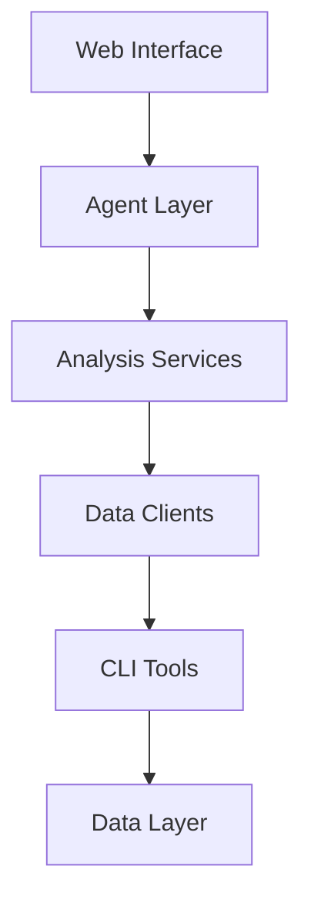

# Architecture Specification

> Generated by spec-gen v1.0.0 on 2026-05-10 22:19

## Purpose

This document describes the architectural patterns and structure of the system.

## Architecture Style

Microservices with agent-based orchestration: specialized agents handle distinct investment domains
(scanning, analysis, trading, alerts) coordinated by a central orchestrator during market hours.

## Requirements

### Requirement: LayeredArchitecture

The system SHALL maintain separation between:
- Web Interface (Dashboard and partial HTML views for portfolio monitoring)
- Agent Layer (Domain-specific investment logic and orchestration)
- Analysis Services (Technical and fundamental analysis calculations)
- Data Clients (External API integration with rate limiting and caching)
- CLI Tools (Standalone analysis and screening utilities)
- Data Layer (Entity persistence and portfolio tracking)

#### Scenario: LayerSeparation
- **GIVEN** a request from the presentation layer
- **WHEN** business logic is needed
- **THEN** the presentation layer delegates to the business layer
- **AND** direct database access from presentation is prohibited

### Requirement: SecurityModel

The system SHALL implement security via: Rate-limited API clients with session-based caching; no explicit authentication model observed in the codebase - appears to be single-user system

#### Scenario: AuthenticatedAccess
- **GIVEN** an unauthenticated request
- **WHEN** accessing protected resources
- **THEN** access is denied

## System Diagram

## Layer Structure

### Web Interface

**Purpose**: Dashboard and partial HTML views for portfolio monitoring
**Location**: `GET /, GET /partial/*, POST /refresh`

### Agent Layer

**Purpose**: Domain-specific investment logic and orchestration
**Location**: `ExtractionAgent, ScannerAgent, AnalystAgent, TraderAgent, AlertAgent, TradingOrchestrator`

### Analysis Services

**Purpose**: Technical and fundamental analysis calculations
**Location**: `BreadthCalculator, DistributionDayCalculator, VCPPatternCalculator, RelativeStrengthCalculator`

### Data Clients

**Purpose**: External API integration with rate limiting and caching
**Location**: `FMPClient, AlphaVantageClient, FinvizStockClient, CongressClient`

### CLI Tools

**Purpose**: Standalone analysis and screening utilities
**Location**: `screen_canslim.py, market_top_detector.py, screen_vcp.py, plan_breakout_trades.py`

### Data Layer

**Purpose**: Entity persistence and portfolio tracking
**Location**: `SQLite database, Trade, Position, StockScan entities`

## Data Flow

External APIs (FMP, Alpha Vantage, Finviz) → Data Clients → Analysis Services → Agent Layer → SQLite
persistence; TradingOrchestrator coordinates agent sequence during market hours; Web interface
provides real-time portfolio monitoring

## External Integrations

| System | Purpose |
|--------|---------|
| Financial Modeling Prep API | External integration |
| Alpha Vantage API | External integration |
| Finviz (web scraping) | External integration |
| QuiverQuant (congressional data) | External integration |
| WisdomWise API | External integration |
| TradingView | External integration |
| Email notifications | External integration |
